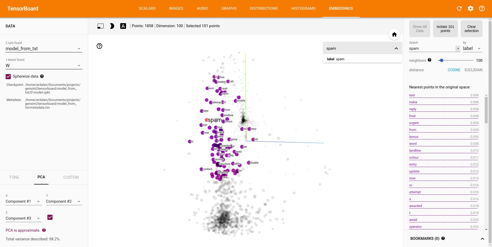

# gensim2tensorboard:
Train word embeddings with [gensim](https://github.com/RaRe-Technologies/gensim) and visualize them with [TensorBoard](https://www.tensorflow.org/how_tos/embedding_viz/).



## Requirements:
- regex
- gensim
- tensorflow (>= 0.12)

## Installation:
```
git clone https://github.com/ArdalanM/gensim2tensorboard.git
```

## Example:
- Train from text file:
```
python3 -m src.train --file "data/SMSSpamCollection.txt" \
                     --input_type 'txt' \
                     --folder "models/SMSSpamCollection"
                     --size 50 \
                     --alpha 0.025 \
                     --window 5 \
                     --min_count 5 \
                     --sample 1e-3 \
                     --seed 1 \
                     --workers 4 \
                     --min_alpha 0.0001 \
                     --sg 0 \
                     --hs 0 \
                     --negative 10 \
                     --cbow_mean 1 \
                     --iter 5 \
                     --null_word 0
```

- Train from csv file:
```
python3 -m src.train --file "data/movie_reviews.csv" \
                     --input_type "csv" \
                     --separator "," \
                     --folder "models/movie_reviews" \
                     --columns_to_select "Phrase" \
                     --size 50 \
                     --alpha 0.025 \
                     --window 5 \
                     --min_count 5 \
                     --max_vocab_size 100000 \
                     --sample 1e-3 \
                     --seed 1 \
                     --workers 4 \
                     --min_alpha 0.0001 \
                     --sg 0 \
                     --hs 0 \
                     --negative 10 \
                     --cbow_mean 1 \
                     --iter 5 \
                     --null_word 0
```

Eventially, visualize the embeddings with tensorboard: 
run tensorboard from the project root folder.
```
tensorboard --logdir=models/ --reload_interval 1
```